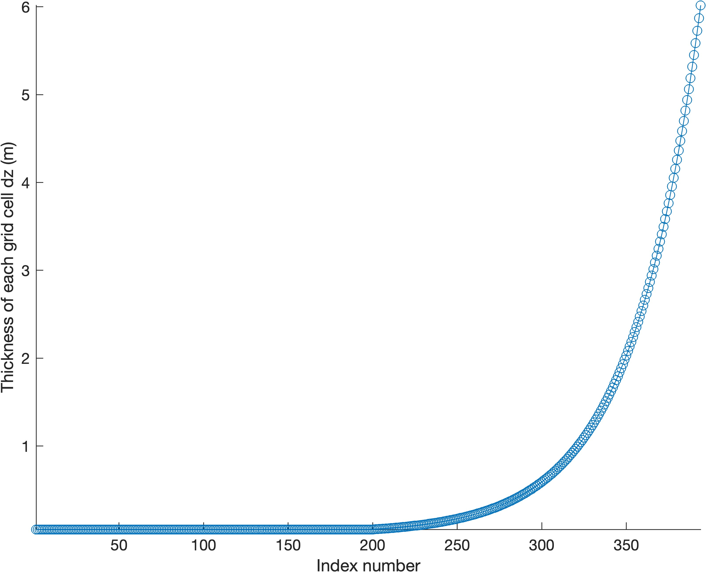

# Documentation for `gridInitialize`
The `gridInitialize` function gridInitialize sets up the initial layer thickness and total grid depth. 

# Syntax 

```matlab
dz = gridInitialize(z_top, dz_top, z_max, beta)
[dz,z_center] = gridInitialize(z_top, dz_top, z_max, beta)
```

# Description 

`dz = gridInitialize(z_top, dz_top, z_max, beta)` creates a 1D grid structure containing the depth `dz` of each cell in the column, where inputs match Fig. 1 of [*Gardner et al*., 2023](https://doi.org/10.5194/gmd-16-2277-2023) and all inputs are scalars as follows: 

 * `z_top` (m): Thickness of the upper portion of the model grid, in which grid spacing is constant.
 * `dz_top` (m): Spacing of the upper portion of the model grid. 
 * `z_max` (m): Maximum thickness of the total column. 
 * `beta` (unitless): Grid cell stretching parameter for the lower portion of the model grid, in which grid length increases linearly with depth. 

`[dz,z_center] = gridInitialize(z_top, dz_top, z_max, beta)` also returns a 1D array z_center containing the center depths of each grid cell in meters.

# Example
In this example, we plot the default inputs described in *Gardner et al.*, 2023: 

```matlab
% Define Inputs: 
z_top  = 10; 
dz_top = 0.05; 
z_max  = 250; 
beta   = 1.025; 

% Calculate grid: 
dz = gridInitialize(z_top, dz_top, z_max, beta); 

plot(dz,'o-') 
xlabel 'Index number'
ylabel 'Thickness of each grid cell dz (m)' 
box off
axis tight

exportgraphics(gcf,'gridInitialize_documentation_01.jpg','Resolution',500)
```



The figure above shows the thickness of each grid cell `dz` as a function of index number, but how does that translate to depth in the snow/ice column? We can build an array of center elevation by calculating the cumulative sum of the thickness values (multiplied by -1 for relative elevation) to get the bottom elevation of each grid cell, then add `dz/2` to represent the center, like this: 

```matlab
z_center = -cumsum(dz) + dz/2; 
```
Or an easier way 

```matlab
[dz, z_center] = gridInitialize_cag(z_top, dz_top, z_max, beta); 

plot(dz,z_center,'o-')
xlabel 'Thickness of each grid cell dz (m)' 
ylabel 'Grid cell center elevation relative to the surface (m)' 
box off

% Add labels for context: 
hold on
yline(-z_max,'color',0.5*[1 1 1])
text(max(xlim),-z_max,'-z_{max}','color',0.5*[1 1 1],'horiz','right','vert','top')

yline(-z_top,'color',0.5*[1 1 1])
text(max(xlim),-z_top,'-z_{top}','color',0.5*[1 1 1],'horiz','right','vert','top')

exportgraphics(gcf,'gridInitialize_documentation_02.jpg','Resolution',500)
```


